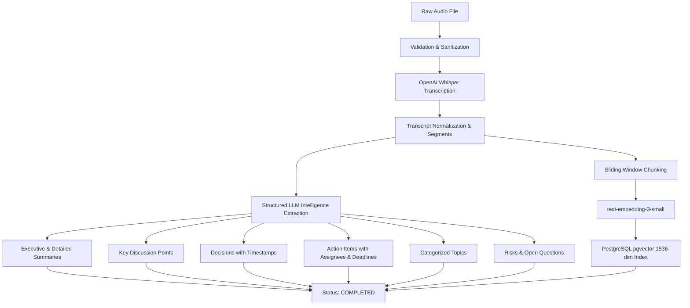

# MeetMind AI Processing Pipeline

## 1. Pipeline Overview

The MeetMind AI processing pipeline transforms raw spoken audio recordings into high-value structured knowledge artifacts and indexed vector embeddings.

---

## 2. Processing Stages

### Stage 1: Audio Ingestion & Validation
- Validates file MIME types (`audio/mpeg`, `audio/wav`, `audio/mp4`, `audio/x-m4a`, `audio/aac`, `audio/flac`).
- Enforces strict size thresholds (default: 100MB).
- Sanitizes file paths preventing path traversal attacks.

### Stage 2: Speech-to-Text Transcription
- Uses **OpenAI Whisper API** (`whisper-1`) with `response_format="verbose_json"`.
- Extracts word- and segment-level timestamps (`start`, `end`, `text`, `confidence`).
- Normalizes raw segments into structured `TranscriptSegment` objects with speaker identification.

### Stage 3: Structured Intelligence Extraction
- Leverages OpenAI models (`gpt-4o`) with strict Pydantic schema validation.
- **Zero-Hallucination Guardrails**:
  - Assignee and deadline fields default to `"Not specified"` if not explicitly uttered by speakers.
  - Every extracted decision and action item captures the exact second-level `source_timestamp` from the segment where it occurred.
- Extracted artifacts include:
  1. Executive Summary & Detailed Sectional Breakdown
  2. Key Points & Takeaways
  3. Action Items with assignees, due dates, and completion status
  4. Strategic Decisions
  5. Topical Categorizations
  6. Unresolved Questions & Project Risks

### Stage 4: Transcript Chunking & Vector Indexing
- Uses `TranscriptChunker` with a sliding window approach (default: 4 segments per chunk with 1 segment overlap) preserving chronological context and speaker boundary continuity.
- Computes 1536-dimensional embeddings for each chunk via `text-embedding-3-small`.
- Stores chunk text, timestamps, speaker metadata, and vector embeddings in PostgreSQL `pgvector`.
