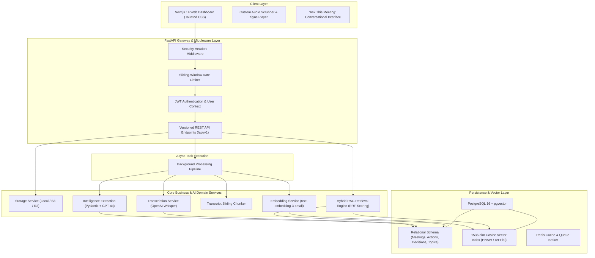

# MeetMind System Architecture

## 1. High-Level Architecture Overview

MeetMind is an enterprise-grade AI Meeting Intelligence & Transcript RAG platform designed with clean separation of concerns, asynchronous job processing, strict multi-tenant isolation, and zero-hallucination conversational intelligence.

---

## 2. Layered Component Breakdown

### 2.1 Frontend Architecture (Next.js 14 App Router)
- **State Management & Auth**: Reactive React Context (`AuthProvider`) maintaining JWT state in local storage and memory, with automatic token injection in all `api` client calls.
- **Audio-Transcript Synchronizer**: Real-time timeupdate listener that computes the active transcript segment index and automatically smooth-scrolls the active segment into view.
- **Clickable Timestamp Links**: Every decision, action item, topic, and RAG citation chip contains an active timestamp. Clicking any timestamp immediately dispatches an audio seek action to that exact second.
- **Responsive Dark SaaS UI**: Custom component library built on Tailwind CSS tokens (`primary-600`, `dark-bg`, `dark-card`, `dark-border`) with subtle glassmorphism and micro-animations.

### 2.2 Backend Architecture (FastAPI & Async SQLAlchemy 2.0)
- **Dependency Injection**: Clean decoupled injection of database sessions (`get_db`), authenticated user contexts (`get_current_user`), and singleton AI services.
- **Data Isolation**: Multi-tenant isolation enforced at the service level; all database queries explicitly filter by `user_id` extracted from cryptographically verified JWT tokens.
- **Async I/O**: End-to-end asynchronous non-blocking queries powered by `asyncpg` and SQLAlchemy 2.0 async sessions with eager loading (`lazy="selectin"`).
- **Validation & Exception Hierarchy**: Unified `AppException` domain exceptions mapped into structured JSON responses with custom HTTP status codes and error codes.

---

## 3. Data Flow & Execution Sequences

### 3.1 Meeting Upload & Ingestion Sequence
1. **Client**: Uploads audio recording via `POST /api/v1/meetings/upload`.
2. **API Layer**: Validates file MIME type, file size limit (100MB), and sanitizes the filename.
3. **Storage Service**: Writes file to persistent storage and generates a unique storage key.
4. **Database**: Inserts a `Meeting` record with status `PENDING`.
5. **Background Task**: Enqueues background pipeline execution and immediately returns `201 Created` with the meeting payload.
6. **Worker**: Orchestrates transcription, structured extraction, chunking, and embedding generation, transitioning status from `PROCESSING` to `COMPLETED`.

### 3.2 Grounded RAG Query Sequence ("Ask This Meeting")
1. **Client**: Submits query via `POST /api/v1/meetings/{id}/ask`.
2. **Embedding Service**: Converts user query into a 1536-dimensional vector using `text-embedding-3-small`.
3. **pgvector & Full-Text Search**: Executes dual retrieval:
   - Vector similarity using cosine distance (`<->`).
   - Keyword relevance matching on transcript chunks for that specific `meeting_id`.
4. **Reciprocal Rank Fusion (RRF)**: Combines vector and keyword search ranks to produce a robust candidate ranking.
5. **Grounded Prompt Assembly**: Formats top retrieved chunks with speaker names and `[MM:SS]` timestamp headers.
6. **LLM Generation**: OpenAI GPT-4o generates an answer restricted exclusively to the provided transcript context, returning structured citations with exact start and end timestamps.
