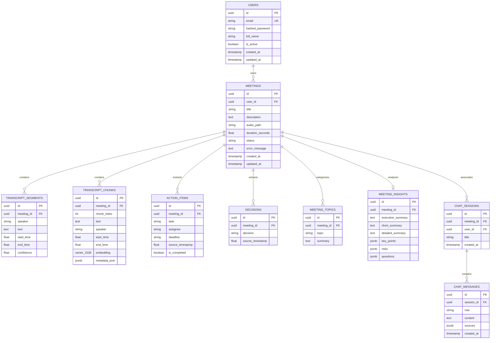

# MeetMind Database Schema Design

## Overview
MeetMind utilizes PostgreSQL 16 with the `pgvector` extension for storing relational meeting metadata, structured intelligence, and 1536-dimensional embeddings.

