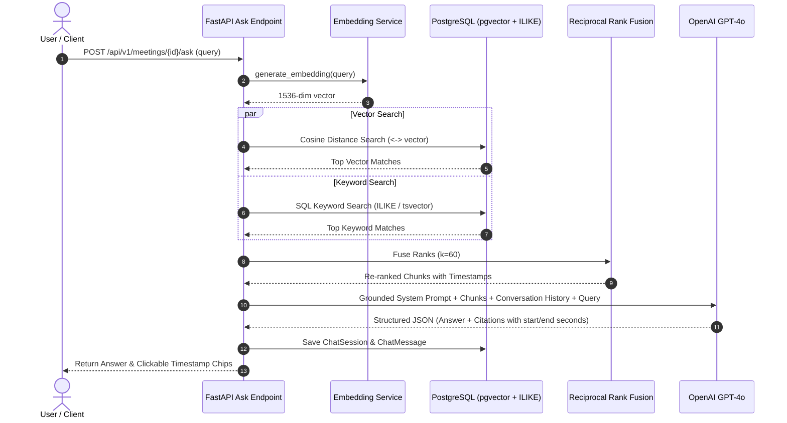

# MeetMind RAG (Retrieval-Augmented Generation) Architecture

## 1. Grounded RAG Overview

MeetMind implements a hybrid transcript-grounded RAG engine enabling users to "Ask This Meeting" questions with strict factual fidelity, zero hallucinations, and clickable source timestamp playback links.

---

## 2. Hybrid Search & Reciprocal Rank Fusion (RRF)

To maximize retrieval recall and precision across both conceptual queries (e.g., *"What were the architectural concerns?"*) and exact terminology queries (e.g., *"What did we decide about PostgreSQL 16?"*), MeetMind implements a hybrid retriever:

1. **Semantic Vector Search**:
   - Computes cosine similarity between user query embedding and stored transcript chunk vectors in pgvector.
   - Filtered strictly by `meeting_id` to guarantee tenant and meeting boundary isolation.

2. **Full-Text / Keyword Search**:
   - Matches specific entity names, project jargon, and exact phrasing against chunk text.

3. **Reciprocal Rank Fusion**:
   - Evaluates combined relevance score for each chunk using the standard formula:
   $$\text{Score}(d) = \sum_{m \in M} \frac{1}{k + r_m(d)}$$
   where $k=60$ and $r_m(d)$ is the chunk rank within retriever $m$.

---

## 3. Strict Anti-Hallucination Guardrails

The RAG system enforces four strict grounding constraints:
1. **Zero External Prior Knowledge**: The model is explicitly constrained to rely only on the transcript chunks provided in context.
2. **Deterministic Fallback**: If the requested information is absent or ambiguous, the model responds with: `"I couldn't find that information in this meeting."`
3. **Source Attributions**: Every statement references the exact speaker and time interval (`[MM:SS] - [MM:SS]`).
4. **Interactive Seek Integration**: The frontend renders citations as interactive chips that immediately seek the audio player and highlight the transcript segment.
